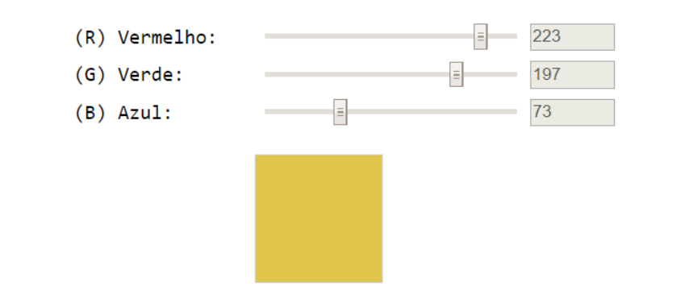
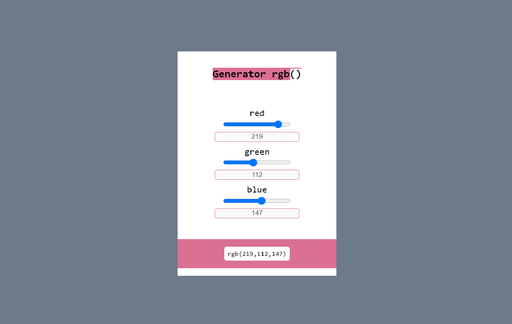

  

<h1 align="center">IGTI - Bootcamp Full-Stack (maio-2020)</h1>

# Trabalho Prático 1

## Objetivo

Exercitar os seguintes conceitos trabalhados no Módulo:

<ul>
  <li>Utilização de elementos HTML</li>
  <li>Utilização de CSS</li>
  <li>Utilização de identificadores em elementos HTML</li>
  <li>Captura de referência de elementos com JavaScript</li>
  <li>Manipulação de eventos com JavaScript</li>
  <li>Utilização de funções com JavaScript e CSS</li>
  <li>Manipulação direta de CSS com JavaScript</li>
</ul>

## Enumciado 

Construa, utilizando HTML, CSS e JavaScript puro, uma aplicação para a visualização de cores a partir da escala
<a href="https://pt.wikipedia.org/wiki/RGB" targer="_blank">RGB</a>

## Atividades

Os alunos deverão desempenhar as seguintes atividades:

<ol>
  <li>Implementar, através de HTML, CSS e JavaScript puro, uma aplicação que contenha três inputs do tipo “range”, cujos valores vão de 0 a 255 e representem, respectivamente, R (Red – Vermelho), G (Green – Verde) e B (Blue – Azul)</li>
  <li>Essa combinação de valores deve ser utilizada para preencher a cor de fundo de uma 
 quadrada</li>
  <li>Além disso, inclua três inputs de texto somente-leitura (desabilitados) para a visualização do valor atual de cada input do tipo range</li>
  <li>À medida em que o usuário modifica o valor dos ranges com as teclas ← e → do teclado, a 
 deve refletir a cor correspondente</li>
</ol>

### Interface de exemplo fornecida pelo professor

  

### Resultado final da aplicação

  

